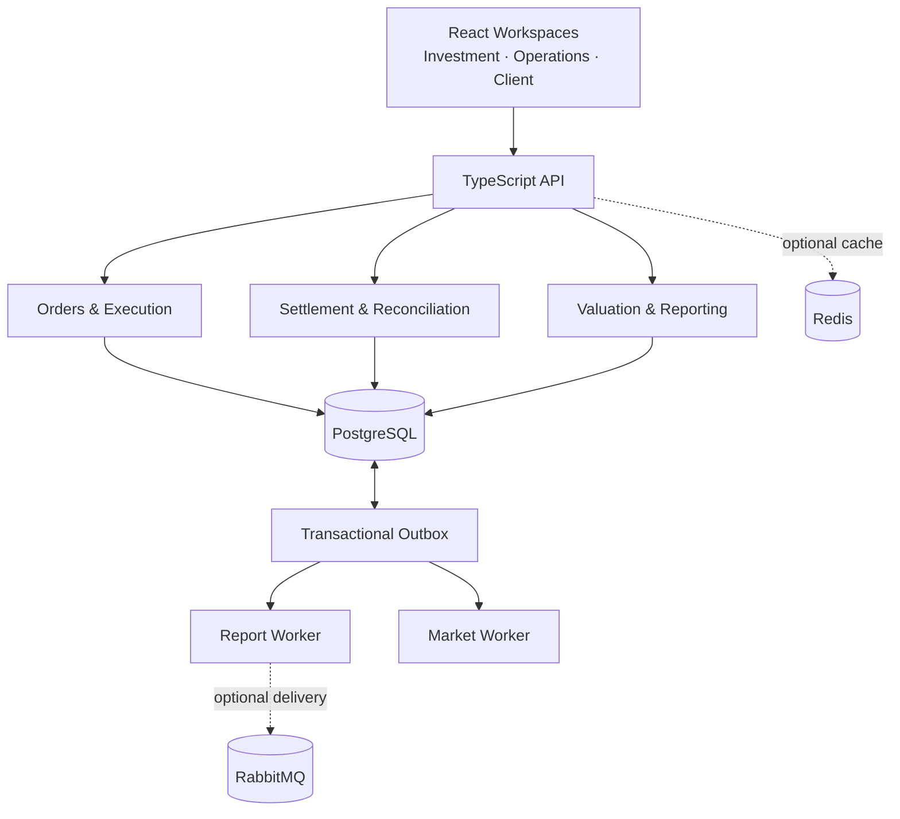

# InvestNexus

A mini investment-management platform that carries a portfolio from an investment decision through execution, settlement, valuation, reconciliation, and a certified client report.

[Open the live browser demo](https://yundii.github.io/InvestNexus/) · [Read the design decisions](docs/design-decisions.md)

## Architecture



## Business flow

```mermaid
flowchart LR
    PM[Portfolio Manager] --> ORDER[Order]
    ORDER --> FILL[Partial / Full Fill]
    FILL --> SETTLE[Settlement]
    SETTLE --> LEDGER[Immutable Ledger]
    LEDGER --> POSITION[Positions & Cash]
    POSITION --> VALUE[Market Valuation]
    VALUE --> RECON[Broker Reconciliation]
    RECON --> CLOSE[Certified Daily Close]
    CLOSE --> REPORT[Client Report]
```



## Key engineering decisions

- **PostgreSQL is the financial source of truth.** Settlement, ledger entries, audit events, snapshots, and outbox messages commit atomically.
- **Positions are derived from the ledger.** Market prices change valuation and P&L without rewriting quantities or cash.
- **Commands are safe to retry.** Idempotency keys, account locks, posting constraints, and append-only records prevent duplicate or partial financial writes.
- **Reports are reproducible.** A daily close freezes holdings, prices, reconciliation evidence, performance, and settled transactions.
- **Async work uses an outbox.** Reporting works with PostgreSQL polling alone; RabbitMQ adds durable delivery, retry, and dead-letter handling.
- **The hosted demo shares domain logic.** GitHub Pages runs an isolated browser simulation, while the local demo exercises PostgreSQL, sessions, and workers.

Detailed market semantics, accounting rules, failure behavior, security boundaries, and infrastructure options are documented in [Design decisions](docs/design-decisions.md).

## Demo

### Online

Open [https://yundii.github.io/InvestNexus/](https://yundii.github.io/InvestNexus/), then click **Start private demo →**. The simulation is stored only in that browser and makes no real trades.

### One-command full stack

Requires Node.js 22.13+:

```sh
git clone https://github.com/yundii/InvestNexus.git
cd InvestNexus
npm run demo
```

Open [http://localhost:4200](http://localhost:4200). The launcher installs missing dependencies, starts or reuses local PostgreSQL, builds and migrates the application, seeds demo accounts, and runs the API plus market and report workers. Press Ctrl+C to stop it.

| Login                      | Workspace access    |
| -------------------------- | ------------------- |
| `pm@investnexus.local`     | Investment / Client |
| `ops@investnexus.local`    | Operations / Client |
| `client@investnexus.local` | Client              |

The local demo password is `LocalDemo-2026!` unless changed in `v2/.env` before seeding.

## Workflow

1. Create and approve a BUY order for 100 MSFT; execute partial fills of 60 and 40 shares.
2. Advance the business date and settle both fills. Positions and cash appear only after settlement.
3. Refresh market data to value the settled portfolio and calculate realized/unrealized P&L.
4. Reconcile broker cash and positions. Investigate and resolve any exception without changing the ledger.
5. Close the daily valuation after prices and reconciliation are certified.
6. Review portfolio and benchmark performance in the Client workspace and export the frozen JSON report.
7. Advance another day and repeat the close to create a multi-day performance series.

## Tech stack

| Layer          | Technology                          |
| -------------- | ----------------------------------- |
| Workspaces     | React                               |
| API and domain | TypeScript, Node.js                 |
| Financial data | PostgreSQL                          |
| Market cache   | Redis (optional)                    |
| Messaging      | RabbitMQ (optional)                 |
| Market data    | Deterministic mock or Alpha Vantage |
| Testing        | Node test runner, Playwright        |
| Delivery       | GitHub Actions, GitHub Pages        |

## Validation

Run the full backend suite from `v2/` with PostgreSQL available:

```sh
npm run build
npm test
npm run test:integration
npx playwright install chromium
npm run test:e2e
```

Validate the static demo without a database:

```sh
npm run build:pages
npm run test:e2e:pages
```

The browser tests execute the complete two-day workflow, download the client report, verify that market moves do not rewrite the ledger, and confirm visitor isolation. GitHub Actions runs both backend and Pages variants before deployment.

## Project layout

```text
scripts/demo.mjs     One-command local launcher
docs/                Architecture and design details
v2/ui/               React workspaces
v2/src/              API, domain logic, repositories, and workers
v2/migrations/       PostgreSQL schema and integrity constraints
v2/test/             Domain and database/API tests
v2/e2e/              Backend and Pages workflow tests
.github/workflows/   CI and GitHub Pages deployment
```

## Current scope

Trading and broker data are simulated. The project currently uses a single-entry position ledger, fixed initial capital, weekday-only T+1 settlement, unadjusted market closes, and price-return benchmarks. Double-entry accounting, external cash flows, TWR/IRR, exchange holidays, dividends, splits, and corporate actions are future milestones.
